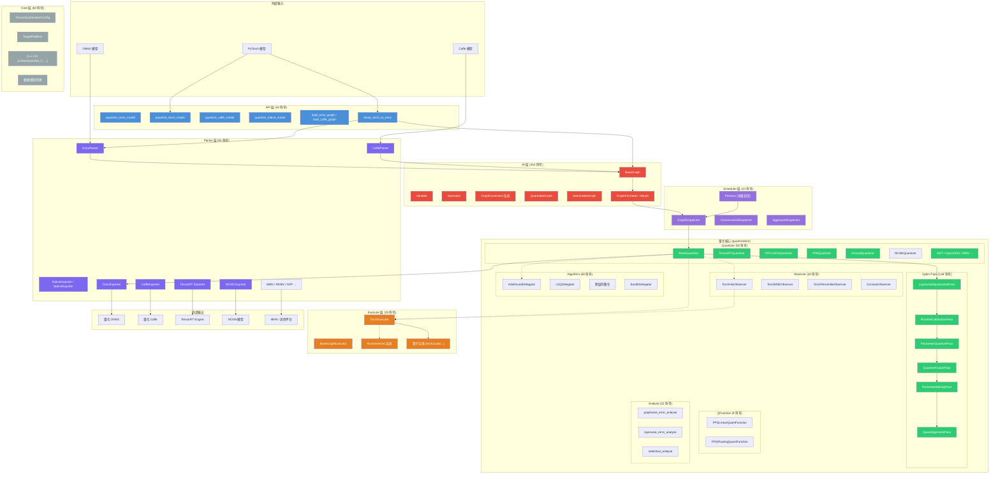

# PPQ 项目架构分析

> PPQ (Pytorch Post-training Quantization) — 离线模型量化工具
>
> 统计: 285 文件 | 6171 符号 | 12464 关系 | 300 执行流 | 22 功能模块

---

## 1. 架构总览图



---

## 2. 项目概览

PPQ 是一个面向深度学习模型的离线量化框架，支持将 PyTorch / ONNX / Caffe 模型量化后部署到多种后端平台（TensorRT、NCNN、OpenVINO、Ascend、MNN、RKNN 等）。项目基于 Python 开发，核心计算依赖 PyTorch，并提供 C++ 扩展（Cuda/Cpu kernel）。

### 顶层目录结构

```
ppq/
├── ppq/                    # 核心包
│   ├── api/                # 用户接口层
│   ├── core/               # 核心定义（数据类型、量化配置、平台枚举等）
│   ├── IR/                 # 中间表示层（计算图、操作、变量）
│   ├── executor/           # 图执行器（推理引擎）
│   ├── parser/             # 模型解析器 & 导出器（ONNX/Caffe）
│   ├── scheduler/          # 算子调度器（平台分配）
│   ├── quantization/       # 量化核心
│   │   ├── quantizer/      #   量化器（目标平台实现）
│   │   ├── optim/          #   优化 Pass 管线
│   │   ├── observer/       #   统计信息观察器
│   │   ├── algorithm/      #   量化算法（训练微调）
│   │   ├── qfunction/      #   量化/反量化函数
│   │   ├── analyse/        #   误差分析工具
│   │   └── measure/        #   度量函数（余弦距离、KL散度等）
│   ├── qat/                # 量化感知训练模块
│   ├── lib/                # 扩展库（Parser/Quantizer 工厂）
│   ├── utils/              # 工具函数
│   ├── log/                # 日志系统
│   ├── csrc/               # C++ 扩展（CUDA/CPU kernel）
│   └── samples/            # 示例代码（TensorRT, QAT, Imagenet等）
├── tests/                  # 测试用例
├── md_doc/                 # 文档目录
├── assets/                 # 资源文件
├── ProgramEntrance_1.py    # 示例入口 1
├── ProgramEntrance_2.py    # 示例入口 2
└── setup.py                # 包安装配置
```

---

## 3. 功能模块总览

| 模块 | 符号数 | 内聚度 | 核心职责 |
|------|--------|--------|----------|
| Caffe | 157 | 94% | Caffe 格式的算子定义与图构建 |
| IR | 152 | 87% | 中间表示：图、操作、变量、命令 |
| Optim | 146 | 87% | 量化优化 Pass 集合 |
| Quantizer | 92 | 96% | 各目标平台的量化器实现 |
| Parser | 91 | 86% | 模型导入/导出（ONNX, Caffe, Native） |
| Base | 82 | 81% | 基础算子 Socket 定义、Variable、Command |
| Algorithm | 60 | 75% | 高级量化算法（Adaround, 均衡化等） |
| Observer | 43 | 92% | 校准统计信息收集 |
| Api | 34 | 81% | 用户 API 接口函数 |
| Executor | 25 | 87% | 图推理执行器 |
| Scheduler | 23 | 100% | 算子调度与平台分配 |
| Analyse | 22 | 84% | 量化误差分析 |
| Torch | 19 | 100% | Torch 后端算子实现 |
| TensorRT | 12 | 100% | TensorRT 推理示例 |
| Lenet_demo | 12 | 100% | LeNet 量化演示 |
| Cluster_200 | 11 | 100% | 辅助功能集群 |
| Qfunction | 9 | 69% | 量化/反量化函数 |
| Qat | 8 | 100% | QAT 量化卷积层 |
| Tests | 7 | 100% | 测试辅助 |
| Imagenet | 7 | 100% | ImageNet 数据工具 |

---

## 4. 核心架构层次

### 4.1 层次关系图

```
┌──────────────────────────────────────────────────────┐
│                    API Layer (api/)                    │
│  quantize_onnx_model / quantize_torch_model / ...     │
├──────────────────────────────────────────────────────┤
│              Scheduler Layer (scheduler/)              │
│  GraphDispatcher → 算子平台分配 (量化/SOI/FP32)        │
├──────────────────────────────────────────────────────┤
│              Quantizer Layer (quantization/)           │
│  ┌────────────┬───────────┬───────────┬───────────┐  │
│  │ Quantizer  │  Optim    │ Observer  │ Algorithm │  │
│  │ (多平台)   │  (Pass)   │  (校准)   │  (调优)   │  │
│  └────────────┴───────────┴───────────┴───────────┘  │
├──────────────────────────────────────────────────────┤
│              Executor Layer (executor/)                │
│  TorchExecutor → 算子级别的图推理                      │
├──────────────────────────────────────────────────────┤
│               IR Layer (IR/)                           │
│  BaseGraph / Operation / Variable / Command            │
├──────────────────────────────────────────────────────┤
│               Core Layer (core/)                       │
│  defs / quant / config / data / ffi / common           │
└──────────────────────────────────────────────────────┘
```

### 4.2 模块详细说明

#### Core 层 (`ppq/core/`)
定义整个框架的基础数据结构和配置。

| 文件 | 职责 |
|------|------|
| `defs.py` | 核心装饰器（SingletonMeta, empty_ppq_cache）和函数标记 |
| `quant.py` | 量化核心抽象：`TargetPlatform`, `NetworkFramework`, `QuantizationPolicy`, `RoundingPolicy`, `TensorQuantizationConfig`, `OperationQuantizationConfig` |
| `config.py` | PPQ 全局配置（版本号、路径等） |
| `data.py` | Tensor 数据类型的转换与封装 |
| `ffi.py` | C++ 扩展的 Python 绑定（FFI），包括 `LinearQuantize_C`, `Histogram_T`, `Quantile` 等 |
| `common.py` | 通用常量和枚举 |
| `storage.py` | 可序列化基类 |

#### IR 层 (`ppq/IR/`)
中间表示层，是框架的核心数据结构。所有模块都围绕 IR 进行工作。

| 文件 | 职责 |
|------|------|
| `base/graph.py` | `BaseGraph`（计算图）、`Variable`（张量变量）、`Operation`（算子节点）— 最核心的三个类 |
| `base/opdef.py` | 所有 ONNX / Caffe 算子的 Socket 定义，约 40K 行 |
| `base/command.py` | `GraphCommand` 系统，用于可撤销的图修改操作 |
| `quantize.py` | `QuantableGraph`, `QuantableOperation`, `QuantableVariable` — 为量化扩展图/操作/变量的能力 |
| `morph.py` | 图变换工具（融合 BN、分离 GELU、移除 Identity 等） |
| `processer.py` | `GraphFormatter`, `GraphMerger`, `GraphReplacer` — 图格式化与后处理 |
| `search.py` | `SearchableGraph` — 图搜索能力 |
| `training.py` | `TrainableGraph` — 为训练扩展图的能力 |
| `deploy.py` | `RunnableGraph` — 可部署的量化图 |

#### API 层 (`ppq/api/`)
用户面向外部的主要接口，是整个量化流程的入口。

| 文件 | 职责 |
|------|------|
| `interface.py` | 核心 API：`quantize_onnx_model`, `quantize_torch_model`, `quantize_caffe_model`, `load_onnx_graph`, `dump_torch_to_onnx`, `dispatch_graph`, `export_ppq_graph` |
| `setting.py` | `QuantizationSetting` 配置系统，控制量化的各项参数 |
| `fsys.py` | 文件系统辅助（加载/保存中间结果） |

#### Scheduler 层 (`ppq/scheduler/`)
负责分析计算图，将算子分配到不同的目标平台。

| 文件 | 职责 |
|------|------|
| `base.py` | `GraphDispatcher` 抽象基类，`value_tracing_pattern` / `reverse_tracing_pattern` |
| `dispatchers.py` | `ConservativeDispatcher`, `AggresiveDispatcher`, `PPLNNDispatcher`, `PointDispatcher` |
| `allin.py` | `AllinDispatcher` — 全部算子分配到量化平台 |
| `perseus.py` | `Perseus` — 高级调度器（传递闭包分析、SOI 标记、量化算子标记） |

**调度概念:**
- **Quantable**: 可量化算子（Conv, Gemm, MatMul 等）
- **SOI** (Shape-Or-Index): 与形状/索引相关的算子（永远不量化，在 CPU 上执行）
- **FP32**: 不可量化但非 SOI 的算子

#### Quantizer 层 (`ppq/quantization/`)

**量化器 (`quantizer/`)** — 各目标平台的量化实现:

| 文件 | 目标平台 |
|------|----------|
| `base.py` | `BaseQuantizer` 抽象基类，定义 `quantize()` 流程 |
| `PPLQuantizer.py` | PPL（商汤自研推理引擎） |
| `TensorRTQuantizer.py` | NVIDIA TensorRT INT8 |
| `FP8Quantizer.py` | FP8 量化（GraphCore / TensorRT） |
| `DSPQuantizer.py` | PPL DSP TI 平台 |
| `AscendQuantizer.py` | 华为 Ascend |
| `NCNNQuantizer.py` | 腾讯 NCNN |
| `ORTQuantizer.py` | ONNX Runtime |
| `OpenvinoQuantizer.py` | Intel OpenVINO |
| `MNNQuantizer.py` | 阿里 MNN |
| `RKNNQuantizer.py` | Rockchip RKNN |
| `NXPQuantizer.py` | NXP 平台 |
| `TengineQuantizer.py` | Tengine |
| `MetaxQuantizer.py` | Metax |
| `MyQuantizer.py` | 自定义量化器模板 |
| `FPGAQuantizer.py` | FPGA 平台 |

**优化 Pass (`optim/`)** — 量化优化管线:

| 文件 | 关键 Pass |
|------|-----------|
| `base.py` | `QuantizationOptimizationPass` 基类，`QuantizationOptimizationPipeline` |
| `calibration.py` | `RuntimeCalibrationPass` — 运行时校准 |
| `parameters.py` | `ParameterQuantizePass`, `PassiveParameterQuantizePass` — 参数量化 |
| `baking.py` | `ParameterBakingPass` — 参数烘焙到算子 |
| `equalization.py` | `LayerwiseEqualizationPass` — 逐层均衡化 |
| `ssd.py` | SSD 算法的校准与优化 |
| `training.py` | 基于训练的微调优化 |
| `refine.py` | `QuantAlignmentPass` — 量化结果精炼 |
| `morph.py` | `QuantizeFusionPass`, `QuantizeSimplifyPass` — 融合与简化 |
| `legacy.py` | `AdaRoundDelegator`, `PPLCudaAddConvReluMerge` 等遗留 Pass |
| `exprimental.py` | 实验性 Pass |
| `extension.py` | 扩展 Pass |

**观测器 (`observer/`)** — 校准统计信息收集:

| 文件 | 关键类 |
|------|--------|
| `base.py` | Observer 基类 |
| `range.py` | `TorchHistObserver`, `TorchMSEObserver`, `TorchPercentileObserver` — 基于范围的校准 |
| `floating.py` | `ConstantObserver`, `DirectMSEObserver` — 浮点校准 |
| `order.py` | 量化配置的渲染与排序 |

**量化算法 (`algorithm/`)** — 高级量化调优:

| 文件 | 关键功能 |
|------|----------|
| `equalization.py` | 跨层均衡化（channel split, bias absorption） |
| `training.py` | `AdaRoundDelegator`, 量化感知微调和 Block 重建 |
| `exprimental.py` | `BanditDelegator` 实验性算法 |

**分析工具 (`analyse/`)**:

| 文件 | 功能 |
|------|------|
| `graphwise.py` | 全图误差分析、统计分析 |
| `layerwise.py` | 逐层误差分析 |

**度量函数 (`measure/`)**:
- `norm.py`: `torch_snr_error`, `torch_mean_square_error`
- `cosine.py`: `torch_cosine_similarity`
- `statistic.py`: 统计度量

**量化函数 (`qfunction/`)**:
- `linear.py`: `PPQLinearQuantFunction`, `PPQLinearQuant_toInt` — 线性量化/反量化
- `floating.py`: `PPQFloatingQuantFunction` — 浮点量化

#### Executor 层 (`ppq/executor/`)
负责在量化过程中执行算子层面的推理。

| 文件 | 职责 |
|------|------|
| `base.py` | `BaseGraphExecutor` 基类，`RuntimeHook` 系统 |
| `torch.py` | `TorchExecutor` — 基于 PyTorch 的图执行器，支持带梯度前向传播 |

`executor/op/torch/` 目录包含所有算子的具体实现:
- `default.py` — 默认算子实现（最大，约 159K）
- `cuda.py` — CUDA 算子实现
- `base.py` — 算子基类
- `nxp.py`, `dsp.py`, `onnx.py` — 平台特定算子

#### Parser 层 (`ppq/parser/`)
模型导入与导出。

| 文件 | 导入/导出 | 格式 |
|------|-----------|------|
| `onnx_parser.py` | 导入 | ONNX → PPQ IR |
| `caffe_parser.py` | 导入 | Caffe → PPQ IR |
| `native.py` | 导入/导出 | PPQ Native 格式 |
| `onnx_exporter.py` | 导出 | PPQ IR → ONNX |
| `caffe_exporter.py` | 导出 | PPQ IR → Caffe |
| `tensorRT.py` | 导出 | PPQ IR → TensorRT Engine |
| `ncnn_exporter.py` | 导出 | PPQ IR → NCNN |
| `onnxruntime_exporter.py` | 导出 | PPQ IR → ONNX Runtime |
| `openvino_exporter.py` | 导出 | PPQ IR → OpenVINO |
| `tengine_exporter.py` | 导出 | PPQ IR → Tengine |
| `mnn_exporter.py` | 导出 | PPQ IR → MNN |
| `qnn_exporter.py` | 导出 | PPQ IR → QNN (Qualcomm) |
| `nxp_exporter.py` | 导出 | PPQ IR → NXP |
| `ascend_export.py` | 导出 | PPQ IR → Ascend |
| `ppl.py` | 导出 | PPL 平台配置 |
| `extension.py` | 导出 | 扩展导出 |
| `util.py` | 辅助 | 转换工具函数 |

#### 辅助模块

| 模块 | 职责 |
|------|------|
| `qat/` (QAT) | `QConv1d`, `QConv2d`, `QConv3d` — 量化感知训练的卷积层 |
| `lib/` | Parser/Quantizer 工厂函数，扩展加载机制 |
| `utils/` | 辅助函数：数值舍入、图编辑器、EMA、TensorRT/OpenVINO 工具 |
| `log/` | 日志系统 |
| `csrc/` | C++ 扩展（CPU/CUDA kernel），通过 `core/ffi.py` 绑定 |

---

## 5. 关键执行流（来自知识图谱追踪）

### 5.1 Quantize Torch Model → Append Variable (8 步)
PyTorch 模型量化的完整路径，从 API 入口到 IR 底层图构建：

```
quantize_torch_model  (ppq/api/interface.py)
  → dump_torch_to_onnx  (ppq/api/interface.py)
    → export             (ppq/api/interface.py)
      → export_ppq_graph (ppq/api/interface.py)
        → copy           (ppq/IR/base/graph.py)
          → create_link_with_op (ppq/IR/base/graph.py)
            → create_variable   (ppq/IR/base/graph.py)
              → append_variable (ppq/IR/base/graph.py)
```

### 5.2 Load Torch Model → Append Variable (7 步)
加载 Torch 模型并构建 IR 图的数据流：

```
load_torch_model    (ppq/api/interface.py)
  → export           (ppq/api/interface.py)
    → export_ppq_graph (ppq/api/interface.py)
      → copy           (ppq/IR/base/graph.py)
        → create_link_with_op (ppq/IR/base/graph.py)
          → create_variable   (ppq/IR/base/graph.py)
            → append_variable (ppq/IR/base/graph.py)
```

### 5.3 Optimize → Get Upstream/Downstream Operations (6 步)
图优化中的算子搜索路径，SSD 优化算法依赖此流程：

```
optimize              (ppq/quantization/optim/ssd.py)
  → collect_all_pairs (ppq/quantization/optim/ssd.py)
    → process         (ppq/IR/search.py)
      → path_matching (ppq/IR/search.py)
        → _path_matching (ppq/IR/search.py)
          → get_upstream_operations   (ppq/IR/base/graph.py)
          → get_downstream_operations (ppq/IR/base/graph.py)
```

### 5.4 Quantize Native Model → Prepare Input (6 步)
Native 模型量化的执行路径，经过 Executor 进行元数据追踪：

```
quantize_native_model   (ppq/api/interface.py)
  → quantize            (ppq/api/interface.py)
    → quantize_onnx_model (ppq/api/interface.py)
      → tracing_operation_meta (ppq/executor/torch.py)
        → __forward            (ppq/executor/torch.py)
          → prepare_input      (ppq/executor/base.py)
```

---

## 6. 核心量化流程

```
                    外部模型(ONNX/Caffe/PyTorch)
                           │
                           ▼
                    ┌──────────────┐
                    │    Parser     │  解析模型 → BaseGraph
                    └──────┬───────┘
                           │
                           ▼
                    ┌──────────────┐
                    │  Formatter    │  图优化(BN融合/Identity移除等)
                    └──────┬───────┘
                           │
                           ▼
                    ┌──────────────┐
                    │  Scheduler    │  算子平台分配(量化/SOI/FP32)
                    └──────┬───────┘
                           │
                           ▼
              ┌────────────────────────────┐
              │     BaseQuantizer.quantize() │
              │                            │
              │  Step 1: Prequant Pipeline │  图结构优化 + 浮点调整
              │  Step 2: 逐算子量化        │  插入Quant/Dequant节点
              │  Step 3: Quant Pipeline    │  校准 + 参数烘焙 + 融合
              └────────────┬───────────────┘
                           │
                           ▼
                    ┌──────────────┐
                    │   Exporter    │  导出到目标平台
                    └──────────────┘
```

### 量化优化 Pipeline (QuantizationOptimizationPipeline)

PPQ 采用 Pass 管线模式管理优化步骤。每个 Pass 继承自 `QuantizationOptimizationPass`，实现 `optimize()` 方法。Pipeline 按顺序执行注册的 Pass。

核心 Pass 列表（按典型执行顺序）：
1. `LayerwiseEqualizationPass` — 跨层均衡化
2. `RuntimeCalibrationPass` — 运行时校准（收集 min/max 等）
3. `ParameterQuantizePass` — 权重量化
4. `PassiveParameterQuantizePass` — 被动参数量化
5. `QuantizeFusionPass` — 量化节点融合
6. `QuantizeSimplifyPass` — 量化节点简化
7. `ParameterBakingPass` — 参数烘焙
8. `QuantAlignmentPass` — 量化结果对齐精炼

---

## 7. 目标平台支持

| 平台 | 量化器 | 精度 | 导出器 |
|------|--------|------|--------|
| NVIDIA TensorRT | TensorRTQuantizer | INT8 / FP8 | tensorRT.py |
| PPL (商汤) | PPLCUDAQuantizer | INT8 | ppl.py |
| PPL DSP TI | PPL_DSP_TI_Quantizer | INT8 | DSP 导出 |
| Huawei Ascend | AscendQuantizer | INT8 | ascend_export.py |
| NCNN | NCNNQuantizer | INT8 | ncnn_exporter.py |
| ONNX Runtime | ORTQuantizer | INT8 | onnxruntime_exporter.py |
| OpenVINO | OpenvinoQuantizer | INT8 | openvino_exporter.py |
| MNN | MNNQuantizer | INT8 | mnn_exporter.py |
| RKNN | RKNNQuantizer | INT8 | RKNN 导出 |
| NXP | NXP_Quantizer | INT8 | nxp_exporter.py |
| Tengine | TengineQuantizer | INT8 | tengine_exporter.py |
| FP8 (GraphCore/TRT) | FP8Quantizer | FP8 | 相关导出 |
| FPGA | FPGAQuantizer | INT8 | FPGA 导出 |
| Metax | MetaxQuantizer | INT8 | Metax 导出 |

---

## 8. 关键设计模式

### 8.1 命令模式 (Command Pattern)
`GraphCommand` 系统（`IR/base/command.py`）封装对计算图的所有修改操作：
- `TruncateGraphCommand` — 图截断
- `ReplaceOperationCommand` — 算子替换
- `ReplaceVariableCommand` — 变量替换
- `QuantizeOperationCommand` — 算子量化

所有命令可被处理器执行/撤销，保证图修改的原子性。

### 8.2 Hook 系统
`RuntimeHook` 系统（`executor/base.py`）在推理执行时插入自定义逻辑：
- `QuantOPRuntimeHook` — 量化算子运行时钩子
- `CalibrationHook` — 校准钩子（收集统计信息）
- `TorchMetaDataTracingHook` — 元数据追踪

### 8.3 工厂模式
`ppq/lib/` 提供：
- `PFL.Parser()` — 根据框架类型返回对应的 Parser 实例
- `PFL.Quantizer()` — 根据目标平台返回对应的 Quantizer 实例

### 8.4 Observer 模式
Observer 在推理执行中收集张量的统计信息（min/max, histogram, MSE等），用于确定量化参数（scale, offset）。

---

## 9. 依赖关系核心路径

```
外部入口 (ProgramEntrance_*.py, test scripts)
  ↓
API (interface.py)           ← 用户调用量化函数
  ↓
Parser (onnx/caffe parser)   ← 加载模型为 BaseGraph
  ↓
Scheduler (dispatchers)      ← 分配算子平台
  ↓
Quantizer (base.py)          ← 执行量化流程
  ├─ Optim Pipeline          ← 优化 Pass 集合
  ├─ Observer                ← 校准统计
  ├─ QFunction               ← 量化/反量化
  └─ Executor                ← 推理执行
  ↓
Exporter (onnx/caffe/ncnn/...) ← 导出量化模型
```

---

*分析生成时间: 2026-05-20 | 基于 GitNexus 代码智能索引*
